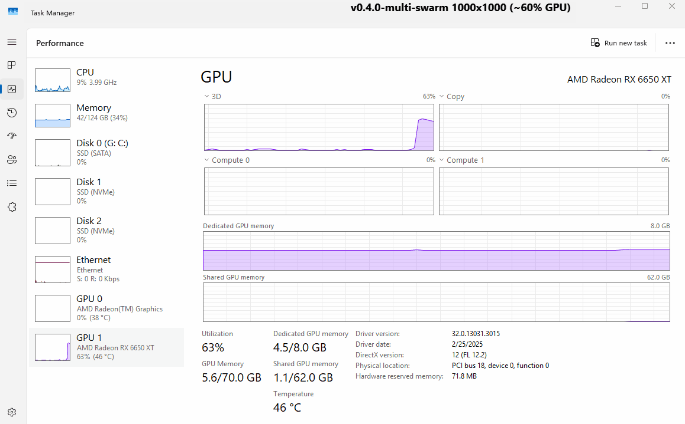

# Godot 4: High-Performance Swarm Rendering

This project is an educational exploration of rendering massive amounts of dynamic instances (100k - 1 Million+) in Godot 4. It documents the journey from standard high-level Nodes to bare-metal `RenderingDevice` compute shaders and GPU stream compaction.

If you are trying to understand how AAA games render massive swarms, flocks, or particle systems without melting the CPU, this repository is your roadmap.

## ⚡ TL;DR

This project explores how to render **1,000,000+ dynamic instances** in Godot 4 without melting the CPU.

- Evolves from high-level nodes → low-level GPU-driven rendering  
- Implements **compute-based culling + stream compaction + indirect draws**  
- Hits **~14% GPU utilization** for a 1M entity swarm (`v0.3.0-indirect-drawing`)
- Exposes real engine limits:
  - VRAM bandwidth (**Copy Tax**)  
  - Draw call overhead (**Draw Call Tax**)  
- Scales to **1,000 independent swarms** in a single compute pass  

## 🧪 Test Hardware

- **GPU:** AMD Radeon RX 6650 XT  
- **API:** Vulkan (Godot 4 `RenderingDevice`)  
- **Driver Capabilities (Vulkan Caps Viewer export):**  (device UUID is redacted)
  - [`AMD-Radeon-RX-6650-XT.json`](AMD-Radeon-RX-6650-XT.json)

## 🛠️ Vulkan Validation Setup (Highly Recommended)

If you're experimenting with the low-level `RenderingDevice` code in this project, enabling Vulkan validation layers is strongly recommended. It will catch synchronization issues, invalid buffer usage, and other GPU-side errors that are otherwise very difficult to debug.

📖 Official Godot Docs:  
https://docs.godotengine.org/en/stable/engine_details/development/debugging/vulkan/vulkan_validation_layers.html

### Setup Steps

1. **Install the Vulkan SDK**
   - https://vulkan.lunarg.com/

2. **Enable Validation Layers**
   - Open the Vulkan Configurator
   - Select `VK_LAYER_KHRONOS_validation`
   - Enable **Synchronization Validation** in the layer settings (JSON)

3. **Launch Godot with Validation Enabled**

```bash
godot.exe --gpu-validation --gpu-abort -e --path multi-mesh
```

> **Windows**: You can add these flags by editing your Godot shortcut and appending them to the Target field.

## 🗺️ The Journey (Git Tags)

You can step through the commit history or check out the specific tags to see how the architecture evolved as we chased maximum performance.

### 1. `v0.1.0-MMI3D` : The Node Baseline
We started with Godot's high-level `MultiMeshInstance3D` node and a basic compute shader to handle movement. 
* **Pros:** Easy to set up, native Godot integration.
* **Cons:** Godot's high-level scene tree still tries to manage the node, and we are drawing everything, even if it's behind the camera.

### 2. `v0.2.0-rs-bypass-culling` : RenderingServer & Scale-to-Zero
We bypassed the Scene Tree entirely and talked directly to Godot's C++ `RenderingServer` via raw RIDs. We also introduced "Scale-to-Zero" frustum culling in the compute shader.
* **How it worked:** If an entity was outside the camera frustum, the compute shader collapsed its transform matrix to `vec4(0.0)`. 
* **The Bottleneck:** While zero-scale degenerate triangles successfully bypass the GPU's hardware rasterizer, the GPU still executes a draw call for *all* instances. The Vertex Shader spins up 1,000,000 times just to read the zeroed-out matrices and throw them away.

### 3. `v0.3.0-indirect-drawing` : GPU Stream Compaction
We completely eliminated the vertex shader bottleneck by preventing the GPU from drawing invisible objects in the first place.
* **How it worked:** Introduced a two-pass compute pipeline that uses an atomic counter to pack only visible instances into a dense array, followed by a command writer pass that formats an indirect draw call for the hardware.
* **The Results:** GPU utilization for a 1-million entity swarm plummeted from 54% to **14%**.

### 4. `v0.4.0-multi-swarm` : The Mega-Buffer 
We decoupled the system to support thousands of distinct swarms, paving the way for each swarm to use entirely different 3D meshes.
* **How it works:** A single compute dispatch calculates physics for `total_instances` entities and mathematically partitions them into a "Mega-Buffer". A third compute pass uses `rd.buffer_copy` to distribute the packed data into Godot's individual `MultiMesh` internal buffers.

---

## Multi-Swarm Architecture & The Abstraction Wall

To render 1,000 distinct swarms (which could each use different 3D models), we cannot use a single Godot `MultiMesh`. We must create 1,000 distinct `MultiMesh` instances on the `RenderingServer`. 

However, we do *not* want to dispatch 1,000 separate compute lists every frame, as that would melt the CPU. 

### The Solution: The Mega-Buffer
We calculate everything in one massive pass.
1. **Pass 1 (Physics & Culling):** Processes 1,000,000 entities. Threads use math (`swarm_id = idx / instances_per_swarm`) to find their specific array slot and pack their final visible transforms into a single, massive **Mega-Buffer**.
2. **Pass 2 (Command Writer):** Writes 1,000 distinct indirect draw commands into a Mega Command Buffer.
3. **Pass 3 (The Data Distributor):** We use 2,000 `rd.buffer_copy` commands to physically slice up our Mega-Buffers and copy the data into the isolated VRAM buffers owned by Godot's native `MultiMesh` RIDs.

### 📊 Profiling & "The Copy Tax"

By exposing our swarm counts to the Godot Inspector via Push Constants, we performed profiling to find the exact hardware limits of this architecture. 

Testing 1,000,000 total instances yielded fascinating GPU utilization results:
* **Test A:** 1 Swarm of 1,000,000 instances (`v0.3.0-indirect-drawing`) = **14% Utilization**
* **Test B:** 1 Swarm of 1,000,000 instances (`v0.4.0-multi-swarm`) = **52% Utilization**
* **Test C:** 1,000 Swarms of 1,000 instances (`v0.4.0-multi-swarm`) = **60% Utilization**

This scenario highlights both the memory bandwidth pressure and the draw call overhead in action:

#### 📽️ Live Capture (Test C)
*Each color represents a distinct swarm. For convenience, all swarms use the same cube mesh, but in a real scenario each swarm could use entirely different geometry.*


**Simulation View:**


**GPU Utilization (Task Manager):**


#### What do these numbers mean?
They map out the exact cost of Godot's engine abstraction versus bare-metal Vulkan:

1. **The Core Compute (14%):** This is the raw math cost of our shaders calculating physics, culling, and stream-compacting 1,000,000 entities.
2. **The Copy Tax (+38%):** Because Godot forces each `MultiMesh` to manage its own memory, we have to copy our 64MB Mega-Buffer to Godot's buffers every single frame. This completely saturates the VRAM memory bus, causing a pipeline stall that spikes utilization from 14% to 52%.
3. **The Draw Call Tax (+8%):** Instructing the hardware rasterizer to change state and draw 1,000 distinct `MultiMesh` objects adds a final 8% overhead compared to drawing a single mesh.

---

## 🧱 The Engine Wall: CPU Dispatches & The Draw Call Tax

While our Mega-Buffer architecture successfully scales up to 1,000 swarms, it reveals a fundamental limitation of the hybrid `RenderingServer` approach: **Godot's high-level renderer is fundamentally built around per-mesh draw calls.**

If you attempt to expand this system from "a few massive swarms" to "10,000 entirely unique meshes" (treating each unique mesh as a swarm of 1), the system will hit a hard CPU bottleneck. Godot's `MultiMesh` is designed to instance a *single* mesh. If you have 10,000 unique meshes, you must create 10,000 distinct `MultiMesh` RIDs. 

Godot's internal C++ engine must then iterate over all 10,000 of them, bind their individual vertex and index buffers, and issue 10,000 separate draw calls to the hardware.  

Modern rendering approaches increasingly move toward GPU-driven pipelines, where visibility, culling, and draw command generation happen directly on the GPU rather than being orchestrated by the CPU. This direction appears to be on Godot’s radar as the engine continues to evolve its rendering architecture for `4.x`.

## 🚀 The Ultimate Fix: Pure `RenderingDevice` (Multi-Draw Indirect)

To completely eliminate the "Copy Tax" and the "Draw Call Tax", one must abandon the hybrid `RenderingServer` approach and build a pipeline that is 100% bare-metal using the `RenderingDevice`.

In a true AAA GPU-driven pipeline, you utilize **Multi-Draw Indirect**. 

Instead of making Godot manage thousands of individual buffers, the architecture shifts to:
1. **The Global Buffer:** Pack the vertices and indices of all 10,000 unique meshes into one gigantic global Vertex/Index buffer upon initialization. 
2. **The Compute Pass:** A compute shader determines what is visible and writes the exact index/vertex offsets for each mesh directly into your Mega Command Buffer.
3. **The Single Draw Call:** Instead of using `rd.buffer_copy` to pass data back to Godot, you bind the Mega-Buffers directly to a custom vertex shader as a storage buffer and use `rd.draw_command_indirect()`. The hardware rasterizer reads directly from the Mega-Buffer on the very next step. Zero copies. One draw call.

### ⚠️ The Brutal Catch

By bypassing `RenderingServer.instance_create()` to issue your own raw Vulkan draw calls, you step entirely outside of Godot's rendering engine ecosystem. Because Godot's high-level renderer no longer knows your objects exist, you instantly lose:
* The ability to use `StandardMaterial3D`.
* Reactions to Godot's built-in directional lights, omni lights, or environment probes.
* The ability to cast or receive shadows in the standard Godot scene.
* Native depth sorting and occlusion with standard Godot nodes.

Building a Multi-Draw Indirect system means taking full responsibility for the rendering pipeline. To get those features back, you would have to write custom GLSL lighting shaders from scratch or manually hook your multi-draw pipeline into Godot's active viewport buffers (Depth, Albedo, Normal) during the engine's opaque pass via C++ or GDExtension.

---

## 🧠 Lessons Learned: The Push Constant State Leak (see `v0.3.0-indirect-drawing`)

During development, we encountered a persistent C++ validation error from Godot's `RenderingDevice` during the frame's compute dispatch:

```text
E 0:00:00:892   mm_test.gd:217 @ _process(): This compute pipeline requires (0) bytes of push constant data, supplied: (112)
  <C++ Error>   Condition "p_data_size != compute_list.validation.pipeline_push_constant_size" is true.
  <C++ Source>  servers/rendering/rendering_device.cpp:5256 @ compute_list_set_push_constant()
```

### The Cause: "Sticky" State
Vulkan (and by extension, Godot's `RenderingDevice`) treats compute lists as state machines. Push constant payloads are "sticky"—they persist until explicitly overwritten or the list is closed.

Originally, we dispatched both our culling pass and our command writer pass inside a single `begin()` and `end()` block. **Crucially, the state does not reset between pipeline bindings within the same list.** We pushed 112 bytes for the culling pass, then immediately bound the command writer pipeline. Because our command writer originally expected `0` bytes, binding it while the 112-byte payload was still active triggered a strict state mismatch error. 

### The Fix: Splitting the Lists
To resolve this, you must isolate the state. We split the operation into two distinct compute lists per frame:

* **List 1:** `begin()` ➔ Bind Culling ➔ Push Constants ➔ Dispatch ➔ Barrier ➔ `end()`
* **List 2:** `begin()` ➔ Bind Command Writer ➔ Push Constants ➔ Dispatch ➔ Barrier ➔ `end()`

By closing the first list and opening a completely fresh one for the second pass, the push constant state is wiped clean.